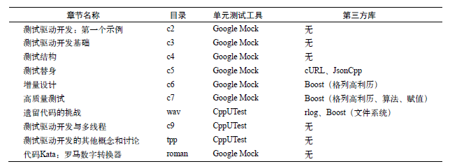

# 环境设置

## 实例程序

书中主要使用了两种测试框架 GMock 与 CppUTest，但是学习过程中希望 Catch 替换掉 CppUTest 与 GMock 并存的方式改版。



## 编译器

主要在 Ubuntu20.04 system 下，使用 Clang-11 为编译器前端，Gun 的 ld 为连接器。

```shell
~/WorkSpace
❯ ls /bin/ld -l
lrwxrwxrwx 1 root root 19 Apr  7  2020 /bin/ld -> x86_64-linux-gnu-ld

~/WorkSpace
❯ clang -v
clang version 11.0.0 (https://github.com/llvm/llvm-project.git 0160ad802e899c2922bc9b29564080c22eb0908c)
Target: x86_64-unknown-linux-gnu
Thread model: posix
InstalledDir: /usr/bin
Found candidate GCC installation: /usr/bin/../lib/gcc/x86_64-linux-gnu/8
Found candidate GCC installation: /usr/bin/../lib/gcc/x86_64-linux-gnu/9
Found candidate GCC installation: /usr/lib/gcc/x86_64-linux-gnu/8
Found candidate GCC installation: /usr/lib/gcc/x86_64-linux-gnu/9
Selected GCC installation: /usr/bin/../lib/gcc/x86_64-linux-gnu/9
Candidate multilib: .;@m64
Selected multilib: .;@m64
```

## CMake

使用 CMake 支持跨平台编译。

```shell
~/WorkSpace
❯ cmake -version
cmake version 3.16.3

CMake suite maintained and supported by Kitware (kitware.com/cmake).
```

## Google Mock & Catch2

安装不在赘述，Google Mock 的版本信息如下：

```shell
/usr/local/lib/cmake/GTest
❯ ls
GTestConfig.cmake  GTestConfigVersion.cmake  GTestTargets-noconfig.cmake  GTestTargets.cmake

/usr/local/lib/cmake/GTest
❯ dpkg -l | grep googletest
ii  googletest                             1.10.0-2                            all          Google's C++ test framework sources
```

Catch2 版本信息如下：

```cxx
/usr/local/lib/cmake/Catch2
❯ ls
Catch.cmake         Catch2ConfigVersion.cmake     Catch2Targets.cmake  ParseAndAddCatchTests.cmake
Catch2Config.cmake  Catch2Targets-noconfig.cmake  CatchAddTests.cmake

/usr/local/lib/cmake/Catch2
❯ vim Catch2ConfigVersion.cmake

>>> set(PACKAGE_VERSION "2.13.3")

```

### 搭建运行 GMock 与 Catch2 的环境

详见此[开源项目](https://github.com/HATTER-LONG/TDD_Learning)

## Json

不打算使用 JsonCPP 切换为开源的 `Json for modern c++`。

```shell
Install the project...
-- Install configuration: ""
-- Up-to-date: /usr/local/include
-- Installing: /usr/local/include/nlohmann
-- Installing: /usr/local/include/nlohmann/json.hpp
-- Installing: /usr/local/lib/cmake/nlohmann_json/nlohmann_jsonConfig.cmake
-- Installing: /usr/local/lib/cmake/nlohmann_json/nlohmann_jsonConfigVersion.cmake
-- Installing: /usr/local/lib/cmake/nlohmann_json/nlohmann_jsonTargets.cmake
-- Installing: /usr/local/lib/pkgconfig/nlohmann_json.pc
```

## libcurl

开源代码安装

```shell
~/Tools/curl-7.74.0/build
❯ sudo make install -j32
[ 73%] Built target libcurl
[100%] Built target curl
Install the project...
-- Install configuration: ""
-- Installing: /usr/local/lib/libcurl.a
-- Installing: /usr/local/bin/curl
-- Installing: /usr/local/bin/curl-config
-- Installing: /usr/local/lib/pkgconfig/libcurl.pc
-- Up-to-date: /usr/local/include/curl
-- Up-to-date: /usr/local/include/curl/curl.h
-- Up-to-date: /usr/local/include/curl/curlver.h
-- Up-to-date: /usr/local/include/curl/easy.h
-- Up-to-date: /usr/local/include/curl/mprintf.h
-- Up-to-date: /usr/local/include/curl/multi.h
-- Up-to-date: /usr/local/include/curl/options.h
-- Up-to-date: /usr/local/include/curl/stdcheaders.h
-- Up-to-date: /usr/local/include/curl/system.h
-- Up-to-date: /usr/local/include/curl/typecheck-gcc.h
-- Up-to-date: /usr/local/include/curl/urlapi.h
-- Old export file "/usr/local/lib/cmake/CURL/CURLTargets.cmake" will be replaced.  Removing files [/usr/local/lib/cmake/CURL/CURLTargets-noconfig.cmake].
-- Installing: /usr/local/lib/cmake/CURL/CURLTargets.cmake
-- Installing: /usr/local/lib/cmake/CURL/CURLTargets-noconfig.cmake
-- Installing: /usr/local/lib/cmake/CURL/CURLConfigVersion.cmake
-- Installing: /usr/local/lib/cmake/CURL/CURLConfig.cmake
```

## Boost

Boost 直接通过 apt-get 安装管理：

```shell
~/Tools
❯ dpkg -l | grep boost
ii  libboost-atomic1.71-dev:amd64          1.71.0-6ubuntu6                     amd64        atomic data types, operations, and memory ordering constraints
ii  libboost-atomic1.71.0:amd64            1.71.0-6ubuntu6                     amd64        atomic data types, operations, and memory ordering constraints
ii  libboost-chrono1.71-dev:amd64          1.71.0-6ubuntu6                     amd64        C++ representation of time duration, time point, and clocks
ii  libboost-chrono1.71.0:amd64            1.71.0-6ubuntu6                     amd64        C++ representation of time duration, time point, and clocks
ii  libboost-container1.71-dev:amd64       1.71.0-6ubuntu6                     amd64        C++ library that implements several well-known containers - dev files
ii  libboost-container1.71.0:amd64         1.71.0-6ubuntu6                     amd64        C++ library that implements several well-known containers
ii  libboost-context1.71-dev:amd64         1.71.0-6ubuntu6                     amd64        provides a sort of cooperative multitasking on a single thread
ii  libboost-context1.71.0:amd64           1.71.0-6ubuntu6                     amd64        provides a sort of cooperative multitasking on a single thread
ii  libboost-coroutine1.71-dev:amd64       1.71.0-6ubuntu6                     amd64        provides a sort of cooperative multitasking on a single thread
ii  libboost-coroutine1.71.0:amd64         1.71.0-6ubuntu6                     amd64        provides a sort of cooperative multitasking on a single thread
ii  libboost-date-time1.71-dev:amd64       1.71.0-6ubuntu6                     amd64        set of date-time libraries based on generic programming concepts
ii  libboost-date-time1.71.0:amd64         1.71.0-6ubuntu6                     amd64        set of date-time libraries based on generic programming concepts
ii  libboost-exception1.71-dev:amd64       1.71.0-6ubuntu6                     amd64        library to help write exceptions and handlers
ii  libboost-fiber1.71-dev:amd64           1.71.0-6ubuntu6                     amd64        cooperatively-scheduled micro-/userland-threads
ii  libboost-fiber1.71.0:amd64             1.71.0-6ubuntu6                     amd64        cooperatively-scheduled micro-/userland-threads
ii  libboost-filesystem1.71-dev:amd64      1.71.0-6ubuntu6                     amd64        filesystem operations (portable paths, iteration over directories, etc) in C++
ii  libboost-filesystem1.71.0:amd64        1.71.0-6ubuntu6                     amd64        filesystem operations (portable paths, iteration over directories, etc) in C++
ii  libboost-graph-parallel1.71-dev        1.71.0-6ubuntu6                     amd64        generic graph components and algorithms in C++
ii  libboost-graph-parallel1.71.0          1.71.0-6ubuntu6                     amd64        generic graph components and algorithms in C++
ii  libboost-graph1.71-dev:amd64           1.71.0-6ubuntu6                     amd64        generic graph components and algorithms in C++
ii  libboost-graph1.71.0:amd64             1.71.0-6ubuntu6                     amd64        generic graph components and algorithms in C++
ii  libboost-iostreams1.71-dev:amd64       1.71.0-6ubuntu6                     amd64        Boost.Iostreams Library development files
ii  libboost-iostreams1.71.0:amd64         1.71.0-6ubuntu6                     amd64        Boost.Iostreams Library
ii  libboost-locale1.71-dev:amd64          1.71.0-6ubuntu6                     amd64        C++ facilities for localization
ii  libboost-locale1.71.0:amd64            1.71.0-6ubuntu6                     amd64        C++ facilities for localization
ii  libboost-log1.71-dev                   1.71.0-6ubuntu6                     amd64        C++ logging library
ii  libboost-log1.71.0                     1.71.0-6ubuntu6                     amd64        C++ logging library
ii  libboost-math1.71-dev:amd64            1.71.0-6ubuntu6                     amd64        Boost.Math Library development files
ii  libboost-math1.71.0:amd64              1.71.0-6ubuntu6                     amd64        Boost.Math Library
ii  libboost-mpi-python1.71-dev            1.71.0-6ubuntu6                     amd64        C++ interface to the Message Passing Interface (MPI), Python Bindings
ii  libboost-mpi-python1.71.0              1.71.0-6ubuntu6                     amd64        C++ interface to the Message Passing Interface (MPI), Python Bindings
ii  libboost-mpi1.71-dev                   1.71.0-6ubuntu6                     amd64        C++ interface to the Message Passing Interface (MPI)
ii  libboost-mpi1.71.0                     1.71.0-6ubuntu6                     amd64        C++ interface to the Message Passing Interface (MPI)
ii  libboost-numpy1.71-dev                 1.71.0-6ubuntu6                     amd64        Boost.Python NumPy extensions development files
ii  libboost-numpy1.71.0                   1.71.0-6ubuntu6                     amd64        Boost.Python NumPy extensions
ii  libboost-program-options1.71-dev:amd64 1.71.0-6ubuntu6                     amd64        program options library for C++
ii  libboost-program-options1.71.0:amd64   1.71.0-6ubuntu6                     amd64        program options library for C++
ii  libboost-python1.71-dev                1.71.0-6ubuntu6                     amd64        Boost.Python Library development files
ii  libboost-python1.71.0                  1.71.0-6ubuntu6                     amd64        Boost.Python Library
ii  libboost-random1.71-dev:amd64          1.71.0-6ubuntu6                     amd64        Boost Random Number Library
ii  libboost-random1.71.0:amd64            1.71.0-6ubuntu6                     amd64        Boost Random Number Library
ii  libboost-regex1.71-dev:amd64           1.71.0-6ubuntu6                     amd64        regular expression library for C++
ii  libboost-regex1.71.0:amd64             1.71.0-6ubuntu6                     amd64        regular expression library for C++
ii  libboost-serialization1.71-dev:amd64   1.71.0-6ubuntu6                     amd64        serialization library for C++
ii  libboost-serialization1.71.0:amd64     1.71.0-6ubuntu6                     amd64        serialization library for C++
ii  libboost-stacktrace1.71-dev:amd64      1.71.0-6ubuntu6                     amd64        library to capture and print stack traces - development files
ii  libboost-stacktrace1.71.0:amd64        1.71.0-6ubuntu6                     amd64        library to capture and print stack traces
ii  libboost-system1.71-dev:amd64          1.71.0-6ubuntu6                     amd64        Operating system (e.g. diagnostics support) library
ii  libboost-system1.71.0:amd64            1.71.0-6ubuntu6                     amd64        Operating system (e.g. diagnostics support) library
ii  libboost-test1.71-dev:amd64            1.71.0-6ubuntu6                     amd64        components for writing and executing test suites
ii  libboost-test1.71.0:amd64              1.71.0-6ubuntu6                     amd64        components for writing and executing test suites
ii  libboost-thread1.71-dev:amd64          1.71.0-6ubuntu6                     amd64        portable C++ multi-threadingii  libboost-thread1.71.0:amd64            1.71.0-6ubuntu6                     amd64        portable C++ multi-threadingii  libboost-timer1.71-dev:amd64           1.71.0-6ubuntu6                     amd64        C++ wall clock and CPU process timers
ii  libboost-timer1.71.0:amd64             1.71.0-6ubuntu6                     amd64        C++ wall clock and CPU process timers
ii  libboost-type-erasure1.71-dev:amd64    1.71.0-6ubuntu6                     amd64        C++ runtime polymorphism based on concepts
ii  libboost-type-erasure1.71.0:amd64      1.71.0-6ubuntu6                     amd64        C++ runtime polymorphism based on concepts
ii  libboost-wave1.71-dev:amd64            1.71.0-6ubuntu6                     amd64        C99/C++ preprocessor libraryii  libboost-wave1.71.0:amd64              1.71.0-6ubuntu6                     amd64        C99/C++ preprocessor libraryii  libboost1.71-all-dev                   1.71.0-6ubuntu6                     amd64        Boost C++ Libraries development files (ALL)
ii  libboost1.71-dev:amd64                 1.71.0-6ubuntu6                     amd64        Boost C++ Libraries development files
ii  libboost1.71-doc                       1.71.0-6ubuntu6                     all          Boost.org libraries documentation placeholder
ii  libboost1.71-tools-dev                 1.71.0-6ubuntu6                     amd64        Boost C++ Libraries development tools
```