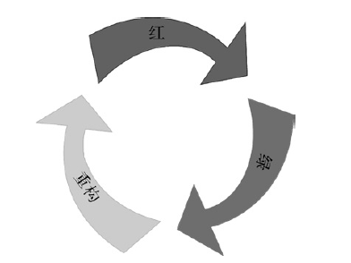

# 测试驱动开发基础

- [测试驱动开发基础](#测试驱动开发基础)
  - [单元测试和测试驱动开发基础](#单元测试和测试驱动开发基础)
    - [单元测试的组织和执行](#单元测试的组织和执行)
    - [测试驱动单元](#测试驱动单元)
  - [测试驱动开发周期：红 - 绿 - 重构](#测试驱动开发周期红---绿---重构)
    - [思考测试驱动开发](#思考测试驱动开发)
  - [TDD 的三条准则](#tdd-的三条准则)
  - [表里不一](#表里不一)
  - [成功运用测试驱动开发的思维](#成功运用测试驱动开发的思维)
    - [增量性](#增量性)
    - [测试行为而非方法](#测试行为而非方法)
    - [使用测试来描述行为](#使用测试来描述行为)
    - [保持简单](#保持简单)
    - [恪守测试驱动开发周期](#恪守测试驱动开发周期)
  - [成功运用 TDD 的方法](#成功运用-tdd-的方法)
    - [下一个测试是什么](#下一个测试是什么)
    - [十分钟限制](#十分钟限制)
    - [代码缺陷](#代码缺陷)
    - [禁用测试](#禁用测试)

## 单元测试和测试驱动开发基础

TDD 会产出单元测试。单元测试验证了一个代码单元的行为，这里的代码单元是一个应用中最小的、可测的一段代码。通常而言，开发单元测试和代码单元要使用一致的编程语言。

### 单元测试的组织和执行

- 单元测试包括一个描述性的名称和一系列代码声明，从概念上可以细分成四个（有序的）部分：
  1. 设置能够运行上下文的语句，这一部分是可选的；
  2. 一条或多条能构成你想要验证的行为的语句；
  3. 一条或多条验证期望输出的语句；
  4. 清理工作的语句（例如，释放所分配的内存），这一部分是可选的。

执行一遍所有的测试称为运行测试（test run 或 suite run）。在运行测试的过程中，**工具会枚举所有的测试，独立地执行每个测试**。对于每个测试来说，测试工具都是从头到尾执行其中的语句的。当执行一条断言语句时，如果断言所期待的条件不满足，那么测试就会失败。反之，测试通过。

### 测试驱动单元

- **TDD 的好处?**
  - 与 POUT 即开发完成后再编写测试不同，TDD 事一个更加简明的流程，并且也使用了单元测试。在 TDD 中先编写测试，并且保持测试的粒度尽量小且一致，这样会带来许多好处，最重要的是可以安全地修改现有代码。

- **怎么进行 TDD?**
  - 在 TDD 中，是以非常小的步伐，增量地往系统中添加新行为。换句话说，为了往系统中加入新的行为，首先会去写一个测试来定义这个行为。这个起初运行失败的测试将驱使你去实现相应的行为。

- **TDD 与功能测试的区别？**
  - TDD 不应该和大量功能的测试混淆。主要区别在于，覆盖了大量功能的测试是与其他代码或者外部实体集成后的整体功能，一般被称为集成测试。此类测试应在验收或者系统测试时进行。
  - TDD 主导的是产生单元测试，是去覆盖最小的逻辑代码单元的测试用例。虽说 TDD 在失败测试通过时才编写产品代码的规则，往往会指引者开发者与外部实体代码进行交互，进而变成集成测试，但是者没有关系。**重要的是现指定行为，系统地测试驱动开发系统中的每一块代码**。

## 测试驱动开发周期：红 - 绿 - 重构

就像第二章中描述的步骤一样：

1. 先写一个测试（“红”）；
2. 让测试通过（“绿”）；
3. 优化设计（“重构”）。



### 思考测试驱动开发

- 总的来说 TDD 过程需要思考两件事情：
  1. 需要编写一个测试说明行为；
  2. 每个周期都要清理代码。

- 在 TDD 周期中的每一步，你必须能回答以下问题：
  1. 写一个小测试：
      - 怎样才算可以增量开发的最小行为？
      - 系统中已经存在这样的行为了么？
      - 怎样让测试名称准确表达行为？
      - 测试中使用的接口是客户端代码使用这一行为最好的方式吗？
  2. 确保新的测试是失败的：
      - 如果没有失败，为什么？
      - 这个行为已经在系统中存在了么？
      - 是否是忘记了编译差异代码？
      - 是不是在上一个测试中步伐太大了，包含了多个行为？
      - 断言是否有效？
  3. 写出你认为可以让测试通过的代码：
      - 代码是不是刚好满足测试说明的行为要求？
      - 你清楚刚才写的代码中哪些地方需要整理么？
      - 是否遵循了团队标准？
  4. 确保所有测试都能通过：
      - 如果没有，你的编码是否正确？
      - 你的规范正确么？
  5. 整理刚才的代码改动：
      - 怎么做才能使你的代码符合团队标准？
      - 新的代码和系统中其他要清除的代码有重复么？
      - 代码有没有坏味？
      - 遵循好的设计原则了吗？
      - 除了当下要做的设计和代码整理工作，你还知道其他什么？
      - 设计是朝好的方向发展吗？
      - 你的代码改动会导致需要修改其他地方的代码吗？
  6. 确保所有测试再次通过：
      - 确信你的单元测试覆盖率够高吗？
      - 是不是应该运行一些速度较慢的测试集合，以便有信息继续前行？
      - 下一个测试是什么？

## TDD 的三条准则

- Robert C. Martin（Bob大叔）提出了践行TDD的[简明规则](http://butunclebob.com/ArticleS.UncleBob.TheThreeRulesOfTdd)。
  1. 只在让失败测试通过时才编写产品代码。
  2. 当测试刚好失败时，停止继续编写。编译失败也是失败。
  3. 只编写能刚好让一个失败测试通过的产品代码。

## 表里不一

TDD 的第一条准则便是在编写代码前先写出一个运行失败的测试，但是经常在开发中碰到刚刚写完一个测试立刻就通过了，这种非期望实践产生的可能原因：

1. 运行了错误的测试；
   - 运行了错误的测试集。
   - 可能新增的测试没有被编译进入执行程序，测试框架的测试用例数量需要时刻关注。
   - 测试框架的种种过滤器用法，是否是新增的测试被过滤了。
   - 测试被关闭、禁止了。
2. 测试了错误的代码；
   - 没有包含最新的测试代码。
   - 没有注意到构建失败了。
   - 构建脚本有缺陷，没有新增测试代码。
   - 你在测试错误的类。同名替身类这些。
3. 不当的测试规范；
   - 类似下例这种，断言的目标与测试描述的行为不符。

    ```cpp
    TEST_F(APortfolio, IsEmptyWhenCreated) {
    ASSERT_THAT(portfolio.isEmpty(), Eq(false));
    }
    ```

4. 对系统的无效假设；
   - 写了一个测试，它一运行就通过了。之所以写测试用例是因为最开始假设这个行为并没有实现。这个通过的测试提醒了你之前的假设是错误的。这时需要停下来，就前面已添加的行为来分析系统这个行为的实现是否合理。
5. 不佳的测试顺序；
   - 测试用例之间不要存在耦合关系，每个单元测试都应该是独立不受顺序影响的。
6. 相关联的产品代码；
7. 过度编码；
   - 在开发功能的过程中往往会有下意识更好的解决方法，例如引入新的数据结构等等，但是其可能导致后续许多的测试用例提前通过，如果你想成功运用TDD，就必须确保增量地引入这些想法，并配以相应的测试。有时候你会觉得自己甚至不需要一个map。与此同时，不做多余需求的实现可以保持代码简单。这样做也可以避免在存在更简单的解决方案时，引入长时间的过度复杂的代码。
8. 确定性测试。
   - 有时候你并不知道代码在一些特定情形下是怎样工作的。你认为 TDD 的代码应该是一个完整的解决方案，但并不确定。“我们的算法处理这一情形了吗？”你可以有针对性地写一个测试来探测系统行为。
9. 思考：
   - 测试提前通过的情况应该很少见。但是这种情形却很重要，可以问自己几个问题：我漏掉了什么？我的步伐是不是大了点儿？我有没有犯愚蠢的错误？如果不这样做会是什么结果呢？和编译警告一样，你始终要去揣摩测试提前通过背后的真相。

## 成功运用测试驱动开发的思维

### 增量性

TDD 以渐进的方式从无到有地开发一个功能完善的系统，每当往系统中加入新行为单元前，都应该为其编写一个测试，并保证以往加入的行为也有对应的测试，你只有在新功能与其他所有功能协同工作时才能继续前进。

TDD 与敏捷开发的流程也相互契合，在每个短的敏捷开发迭代周期，都可以定义、构建并发布少量的功能，而 TDD 则会保证你的修改是否影响其他功能以及新开发的功能指定行为是否正确。

### 测试行为而非方法

TDD 不应该集中精力去测试成员函数。“我们实现了一个 add() 成员函数。再写一个 TEST(ARetweetCollection, Add) 的测试。”想要完全覆盖一个 add 行为的测试需要考虑多种不同情况，非常浪费精力。

- 相反将注意力放在描述行为上：
  - 如果加入一个已经加入的 add 参数？
  - 如果客户传入一个空的参数？
  - 如果加入的参数不在生效？
  - ......等等。

### 使用测试来描述行为

测试可以被看作一个示例，用它描述或文档化系统中的行为。

- 可以通过下列两个方面来编写一个良好的测试：
  1. 测试名称，它概括了在特定上下文中系统表现出的行为；
  2. 测试语句本身，它精炼地展现了一个测试的行为。

```cpp
TEST_F(ARetweetCollection, IgnoresDuplicateTweetAdded) {
    Tweet tweet("msg", "@user");
    Tweet duplicate(tweet);
    collection.add(tweet);
    collection.add(duplicate);
    ASSERT_THAT(collection.size(), Eq(1u));
}

//> 测试名称提供了高层次的概括：应该忽略重复添加的 tweet。但什么才算重复的 tweet？忽略重复的 tweet 意味着什么？这个测试提示了一个简单的示例，清楚地回答了这两个问题。当一个 tweet 和另一个 tweet 完全相同时，算作重复；当加入一个重复的 tweet 后，tweet 集合的大小不变。
```

越是重视 TDD 的文档功能，越懂得高质量测试的重要性。测试的文档功能是 TDD 的附属产物。为了确保在单元测试中的投入得到良好的回报，必须保证其他人能够很容易地理解测试，否则你的测试就是在浪费他们的时间。良好的测试可以通过全面地记录系统行为来节省时间。只要所有的测试都通过，它们就准确地传达了系统的内部行为。文档也不会过时。

### 保持简单

有很多愿意导致开发人员制造非必要的复杂性：

1. 时间压力；
2. 缺乏学习；
3. 已有的复杂；
4. 害怕改代码；
5. 臆测；

但是保持简单才是在持续变化的环境中的生存之道。最好的防范办法就是保持简单的设计：代码易读、没有冗余、没有无谓的复杂性。具有这些特征的系统会最大程度地降低维护成本。

### 恪守测试驱动开发周期

请遵循“红-绿-重构”周期，非常重要。

## 成功运用 TDD 的方法

### 下一个测试是什么

一个答案便是：如果一个测试需要的产品代码最少，那么就写这个测试。

还可以使用`变换优先级假设（Transformation Priority Premise，TPP）`模式，第十章有讲解。大致描述：将每步变换分类。所有的变换按从最简单（最高优先级）到最复杂（最低优先级）安排优先级顺序。你要做的就是选择一个最高优先级的变换，然后为此变换写一个测试。按照变换优先级增量地进行，就能得到一个理想的测试顺序。

- 除此之外，可以回答下列问题做出决定：
  1. 从逻辑上来说，那个行为最具有意义？
  2. 你可以验证这个有意义的行为中哪个最小集合？
  3. 你能写一个测试来说明当前的行为不完备吗？

### 十分钟限制

TDD依赖较短的反馈周期。但有时遇到困难，例如重构代码时破坏了一些测试，又或者需要 GDB 工具查找问题。

当遇到这些痛苦时间后，从上一个测试通过算起，不要超过 10 分钟。如果限定时间到了，那么丢掉之前的修改重新来过。不要过分纠结代码，特别时和现在做的不相干的代码，大可忽略他们，不要写超过 10 分钟的代码，你的方案可能质量不高。重新整理思绪，用全新的视角与方法再进行尝试。

### 代码缺陷

使用 TDD 几乎不会出现一些愚蠢的逻辑错误。那还会有哪些呢？其他的事情也会出现问题：没人预料到的条件、不同步的外部事情（例如，配置文件），以及多个方法或类合在一起时表现出的奇怪行为。如果规范有问题也会出错，包括因粗心而忽略掉一些东西，你和客户间的误解。TDD 不是银弹，却有助于消除一些人人都会犯的逻辑错误。（更重要的是，它是精细打磨系统设计的绝妙方法。）

当 QA 或客户支持团队当面给你指出一个代码缺陷时，你该怎么做？嗯，测试驱动！你或许可以先写一些简单的测试来探测系统行为。专注于相关代码的测试能帮助你更好地理解代码是怎样工作的，也有助于解读代码缺陷。有些时候，你可以保留这些测试，并把它们用作特征测试。有时候则可以丢弃这些类似一次性工具的测试。一旦查明问题根源，也不要简单修复，继续做其他事情吧。我们是在测试驱动开发！相反，写一个你认为能模拟暴露缺陷的行为的测试。确保测试失败（红），修复它（绿），重构。

### 禁用测试

正常情况下，在测试驱动开发时一次只关注一件事情。个别情况下，当你忙于让第一个测试通过时，第二个测试失败了。如果另一个测试失败，这意味着你的第一个测试没能遵守“红-绿-重构”周期（除非这两个测试是因为同一个原因而失败）。

为了不让第二个失败的测试分散你的注意力，可以让它暂时失效。

不要提交被禁用（或注释掉）的测试的代码，除非你有充足的理由。集成后的代码应该反映系统的当前功能。注释掉的测试（或产品代码）会浪费其他开发者的时间。“测试被注释掉是因为没有这个行为了吗？这个测试有问题？处于变动中？这个测试运行太慢以至于需要的时候才启用它？我是不是应该找个人讨论一下这个测试？”
